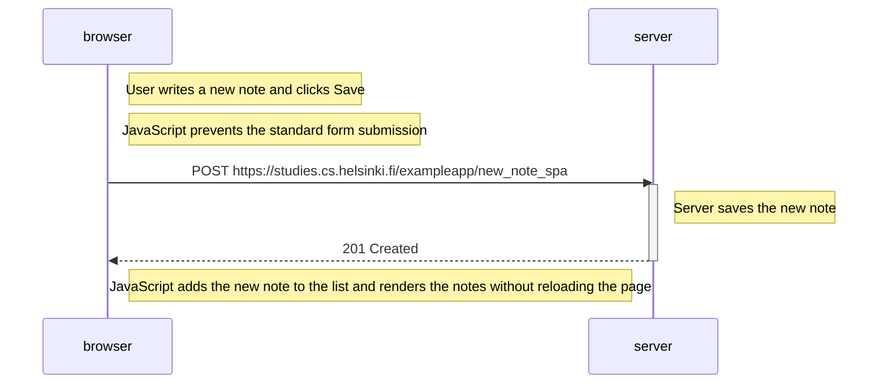

```mermaid
sequenceDiagram
    participant browser
    participant server

    Note right of browser: User writes a new note and clicks Save
    Note right of browser: JavaScript prevents the standard form submission

    browser->>server: POST https://studies.cs.helsinki.fi/exampleapp/new_note_spa
    activate server
    Note right of server: Server saves the new note
    server-->>browser: 201 Created
    deactivate server

    Note right of browser: JavaScript adds the new note to the list and renders the notes without reloading the page
```
